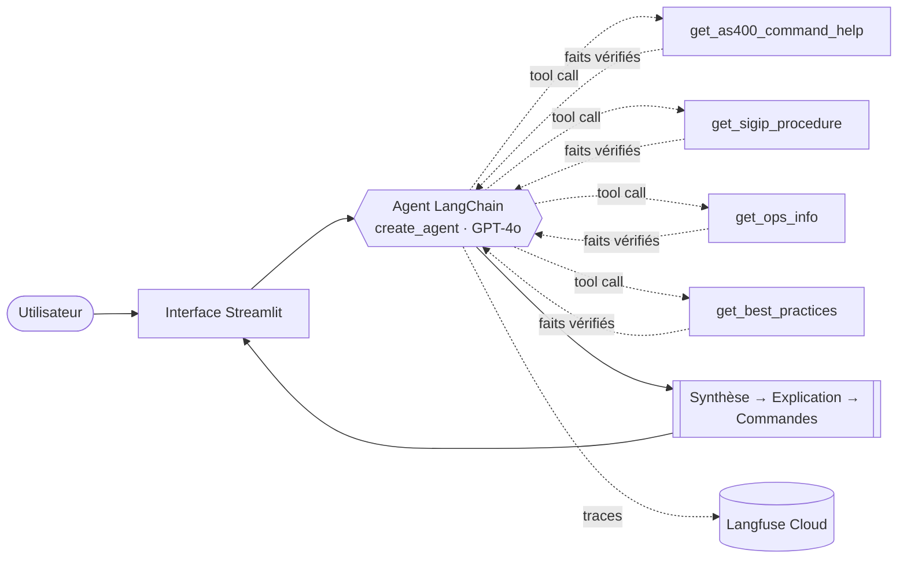
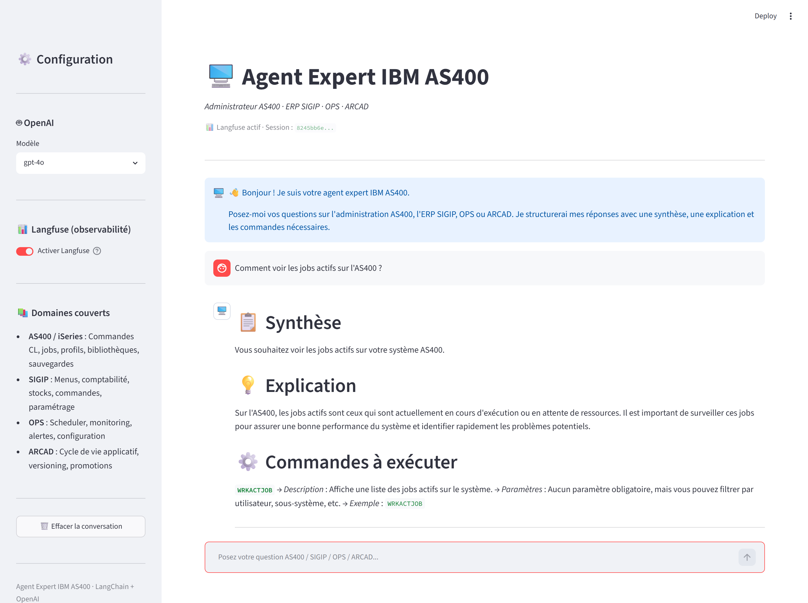

# 🖥️ Agent Expert IBM AS400

> Agent conversationnel spécialisé en administration IBM iSeries (AS400), ERP SIGIP, module OPS et outil ARCAD — construit avec LangChain v1.0, servi par Streamlit, tracé de bout en bout avec Langfuse.

[](https://www.python.org/)
[](https://python.langchain.com/)
[](https://streamlit.io/)
[](https://langfuse.com/)
[](https://platform.openai.com/)

---

## Le problème

L'AS400 (IBM iSeries) fait tourner des systèmes critiques depuis les années 90 — comptabilité, stocks, production. Mais la connaissance opérationnelle repose sur une poignée d'experts proches de la retraite, et la documentation d'ERP propriétaires comme **SIGIP** n'existe souvent que sous forme de classeurs papier et de mémoire d'équipe.

Un LLM généraliste connaît mal ces environnements : il hallucine des commandes CL plausibles mais fausses, et ignore totalement les spécificités d'un ERP maison.

## L'approche

Plutôt que de laisser le modèle improviser, l'agent s'appuie sur **quatre tools** qui exposent une base de connaissances curée. Le LLM décide quand les appeler, puis rédige une réponse structurée à partir de faits vérifiés.



### Les tools

| Tool | Rôle | Couverture |
|------|------|-----------|
| `get_as400_command_help` | Fiche détaillée d'une commande CL : description, syntaxe, paramètres, cas d'usage | **18 commandes** (`WRKACTJOB`, `SAVLIB`, `ENDJOB`, `WRKUSRPRF`, `GRTOBJAUT`…) |
| `get_sigip_procedure` | Procédures fonctionnelles de l'ERP SIGIP | **6 domaines** (comptabilité, stocks, commandes, utilisateurs, paramétrage, sauvegarde) |
| `get_ops_info` | Fonctionnement du module OPS | **5 sujets** (scheduler, monitoring, alertes, jobs, configuration) |
| `get_best_practices` | Recommandations opérationnelles | **4 contextes** (sauvegarde, sécurité, performance, maintenance) |

> **Honnêteté technique** — la base de connaissances est *statique et embarquée* dans [`agent_ibm.py`](agent_ibm.py). L'agent ne se connecte pas à une machine AS400 réelle : il n'exécute aucune commande, il explique. C'est un choix délibéré (sécurité, reproductibilité, absence de dépendance à un système de production). Brancher un backend live — SQL sur DB2 for i, ou API IBM i Access — se ferait en remplaçant le corps des tools, sans toucher à l'agent.

## Fonctionnalités

- **Réponses structurées** en trois temps imposés par le system prompt : *Synthèse → Explication → Commandes*
- **Température à 0.2** — on veut des commandes exactes, pas de la créativité
- **Mémoire conversationnelle** glissante sur les 10 derniers échanges (20 messages)
- **Choix du modèle** à chaud : `gpt-4o`, `gpt-4o-mini`, `gpt-4-turbo`
- **Questions d'exemple** cliquables au démarrage, réparties par domaine
- **Observabilité optionnelle** : l'app fonctionne parfaitement sans Langfuse, le toggle se désactive proprement si les clés sont absentes
- **Zéro saisie de clé dans l'UI** — les secrets viennent de l'environnement, jamais de l'interface

## Démo

<!-- Ajoute une capture d'écran ici : docs/screenshot.png -->
<!--  -->

*Capture d'écran à venir.*

## Démarrage rapide

```bash
git clone https://github.com/<votre-compte>/AgentIBM.git
cd AgentIBM

python -m venv .venv
.venv\Scripts\activate          # Windows
# source .venv/bin/activate     # macOS / Linux

pip install -r requirements.txt

cp .env.example .env            # puis renseigner OPENAI_API_KEY

streamlit run app.py
```

L'app démarre sur `http://localhost:8501`. Seule `OPENAI_API_KEY` est obligatoire.

**Prérequis** : Python 3.10+ · un compte [OpenAI](https://platform.openai.com/) · *(optionnel)* un compte [Langfuse Cloud](https://cloud.langfuse.com/).

## Configuration

Les clés sont résolues par [`get_secret()`](app.py#L15) qui tente `st.secrets` (Streamlit Cloud) puis retombe sur les variables d'environnement (`.env` en local). Le même code tourne donc dans les deux environnements sans branche conditionnelle.

### En local — `.env`

```env
OPENAI_API_KEY=sk-...
LANGFUSE_PUBLIC_KEY=pk-lf-...      # optionnel
LANGFUSE_SECRET_KEY=sk-lf-...      # optionnel
LANGFUSE_BASE_URL=https://cloud.langfuse.com
```

### Sur Streamlit Cloud — **Settings → Secrets**

```toml
OPENAI_API_KEY = "sk-..."
LANGFUSE_PUBLIC_KEY = "pk-lf-..."
LANGFUSE_SECRET_KEY = "sk-lf-..."
LANGFUSE_BASE_URL = "https://cloud.langfuse.com"
```

### Sécurité des secrets

- `.env`, `.env.*`, `.streamlit/secrets.toml`, `*.pem` et `*.key` sont exclus par [`.gitignore`](.gitignore) — seuls les fichiers `.example` sont versionnés
- Aucune clé n'est affichée, loggée ou saisie dans l'interface
- La clé de cache de l'agent en session est un **hash SHA-256** de `clé + modèle` ([`app.py:167`](app.py#L167)) — la clé en clair ne transite jamais par `session_state`

## Déploiement sur Streamlit Cloud

1. Pousser le dépôt sur GitHub (les secrets sont exclus par `.gitignore`)
2. Connecter le dépôt sur [share.streamlit.io](https://share.streamlit.io)
3. Fichier principal : `app.py`
4. Renseigner les secrets dans **Settings → Secrets**
5. Déployer

## Observabilité

Quand Langfuse est activé, chaque conversation est tracée :

- appels LLM — modèle, tokens, latence, coût
- appels aux tools — arguments et valeurs retournées
- `session_id` unique (UUID) regroupant tous les échanges d'une conversation
- tags `ibm-expert`, `as400`, `sigip`, `ops`, `arcad`

Utile pour repérer les questions où l'agent n'appelle *pas* le bon tool — le principal signal d'amélioration de la base de connaissances.

## Structure du projet

```
AgentIBM/
├── agent_ibm.py              # System prompt, 4 tools, création de l'agent, appel tracé
├── app.py                    # Interface Streamlit, résolution des secrets, état de session
├── requirements.txt
├── .env.example              # Template de clés (versionné)
├── .gitignore
└── .streamlit/
    └── secrets.toml.example  # Template Streamlit Cloud (versionné)
```

Deux fichiers, une séparation nette : `agent_ibm.py` ne connaît rien de Streamlit, `app.py` ne connaît rien de LangChain au-delà de trois fonctions (`create_ibm_agent`, `ask_agent`, `init_langfuse`). L'agent est réutilisable tel quel derrière une API ou un bot.

## Stack technique

| Composant | Technologie |
|-----------|-------------|
| LLM | OpenAI GPT-4o (`temperature=0.2`) |
| Framework agent | LangChain v1.0 — `create_agent` + `@tool` |
| Runtime graphe | LangGraph |
| Interface | Streamlit |
| Observabilité | Langfuse Cloud (`CallbackHandler`) |
| Gestion des secrets | `python-dotenv` + `st.secrets` |

## Pistes d'évolution

- Connexion live en lecture seule à DB2 for i pour l'état réel des jobs et bibliothèques
- Base de connaissances externalisée (YAML/SQLite) puis recherche vectorielle, pour dépasser le lookup par mot-clé exact
- Évaluations Langfuse sur un jeu de questions de référence, pour mesurer les régressions à chaque évolution du prompt
- Authentification et historique persistant par utilisateur

---

*Projet personnel — démonstration d'un agent LLM outillé sur un domaine métier de niche.*
